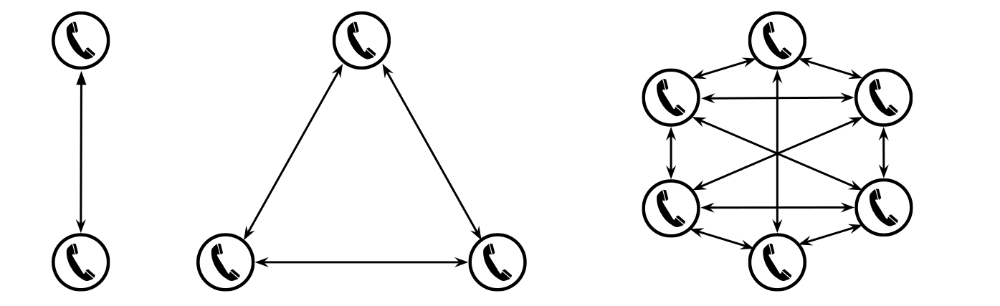
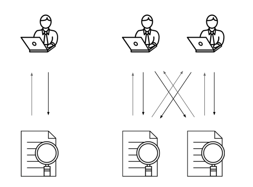

```{r prep, include=FALSE}
knitr::opts_chunk$set(fig.path='../misc/rmd-',
                      cache.path='../data/cache/rmd-',
                      fig.height=3)
load(file = '../data/results.RData') # load results data
load(file = '../data/merged.RData')  # load source  data
load(file = '../data/ITU2015.RData')
library(ggplot2)
# library(ggvis)
library(printr) # load (customised) printr package for clean output of lm()
library(dplyr)
attach(adulthh)
```

## Introduction

* improved reach and affordability
* yet, stagnating growth

```{r adoption_plot, cache=TRUE}
ggplot(data=ITUint, aes(x=year, y=adoption, colour=region)) + geom_smooth(se=FALSE) 
```


## Language Disparities


**QUESTION**: lowest bars, chicken vs. egg?

```{r interactive, eval=FALSE, echo=FALSE}
ITU2015 %>%
  ggvis(~year, ~adoption, stroke=~region) %>%
  group_by(region) %>%
  layer_smooths(span = input_slider(0.75, 1, value = 1), se=TRUE, fill=~region) %>%
  bind_shiny("ggvis", "ggvis_ui")
```


## Cross-Side Network Effects (2SM)






## Stacked 2-Sided Markets


## Research Design

**Identification Strategy**: Setswana introduced on `google.co.za` at end the of 2010

  * Spillover of translation work for `google.co.bw`
  
**Data**: South Africa's National Income Dynamics Survey (2008, 2010, 2011)

  * around 10,000 households; 50,000 adults; 10,000 Setswana speakers
  * cellphones; computers; internet access and expenditure

```{r data_plot, cache=TRUE}
ggplot(data=NIDS, aes(x=language, fill=woman)) + geom_bar()
```


## Internet Usage

```{r lm4_5pres, cache=TRUE, echo=TRUE}
lm(h_nfnet ~  interface_intro*setswana +
              woman                    +
              hhincome             	   + 
              best_edu)
```

* Covariates: linguistic skills
* Alt. formulation, Interact `interface_intro` with `language`: similar results


## Computer Ownership

```{r lm2_5pres, cache=TRUE}
lm(a_owncom ~ interface_intro*setswana + 
              woman                    + 
              hhincome             	   + 
              best_edu)
```


## Usage of Setswana online

```{r gt_data, echo=FALSE, cache=TRUE}
load(file = '../data/googletrends.RData')
```

```{r googletrends, cache=TRUE}
ggplot(thuso) + geom_smooth(aes(x = date, y = thuso))
```

* thuso = help (common term on Google Trends)


## Internet Expenditure -> Employment

```{r load_stata12, echo=FALSE, cache=TRUE}
rm(adulthh)
load(file = '../data/merged-stata12.RData')
```

```{r nf_net_empl, cache=TRUE}
pids <- adulthh[which(adulthh$wave==3 & adulthh$h_nfnet==TRUE),]$pid
adulthh %>%
  filter(pid %in% pids) %>%
  group_by(setswana, wave) %>%
  summarise(employed = mean(employed, na.rm=TRUE)) %>%
  ggplot(aes(x=wave, y=employed, colour=setswana)) %+%
    geom_line() %+%
    scale_colour_brewer(palette='Set1')
```


## Computer Ownership -> Employment

```{r own_comp_empl, cache=TRUE}
pids <- adulthh[which(adulthh$wave==3 & adulthh$a_owncom==TRUE),]$pid
adulthh %>%
  filter(pid %in% pids) %>%
  group_by(setswana, wave) %>%
  summarise(employed = mean(employed, na.rm=TRUE)) %>%
  ggplot(aes(x=wave, y=employed, colour=setswana)) %+%
    geom_line() %+%
    scale_colour_brewer(palette='Set1')
```


## Closing Remarks

    If you talk to a man in a language he understands that goes to his head.
    
    If you talk to a man in his language that goes to his heart.
    
                                                     - Nelson Rolihlahla Mandela

* accessibility improves adoption
* observed long term commitment: computer ownership
* mobile needs directly visible link
* available online: http://qua.st/internet-access
    * data
    * code
    * paper
    * presentation
