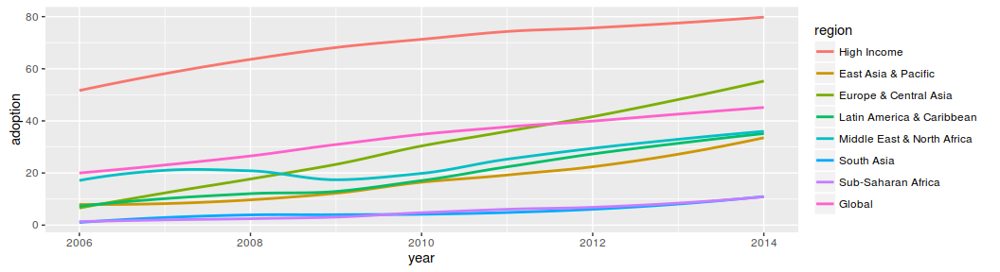
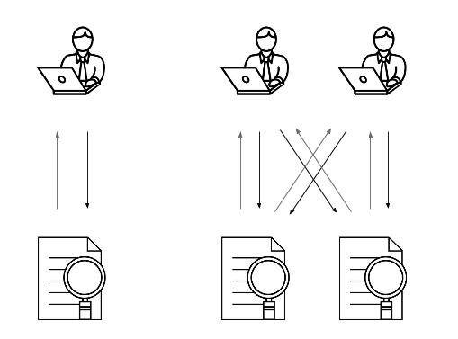
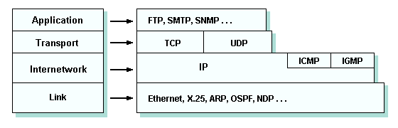
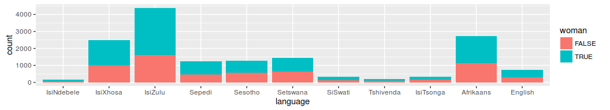
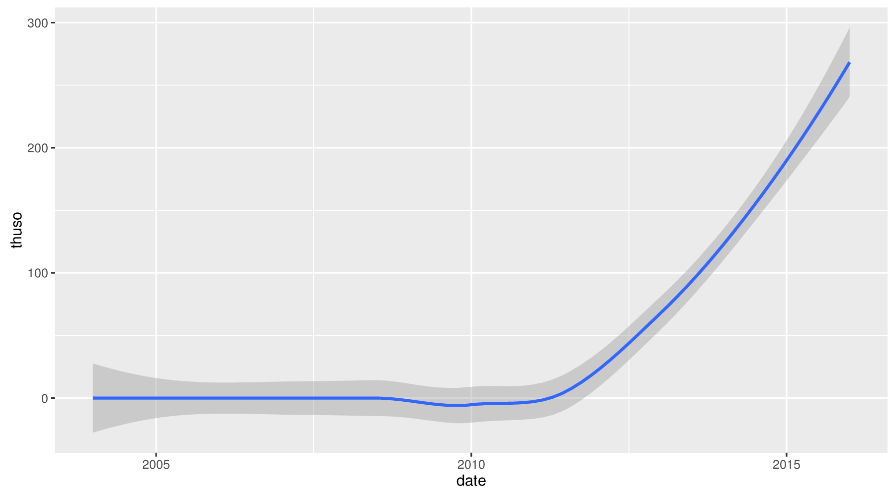
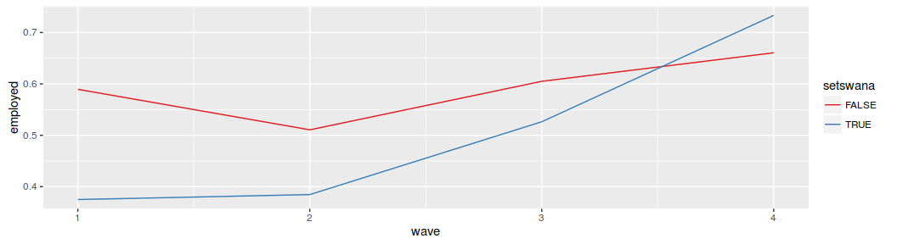
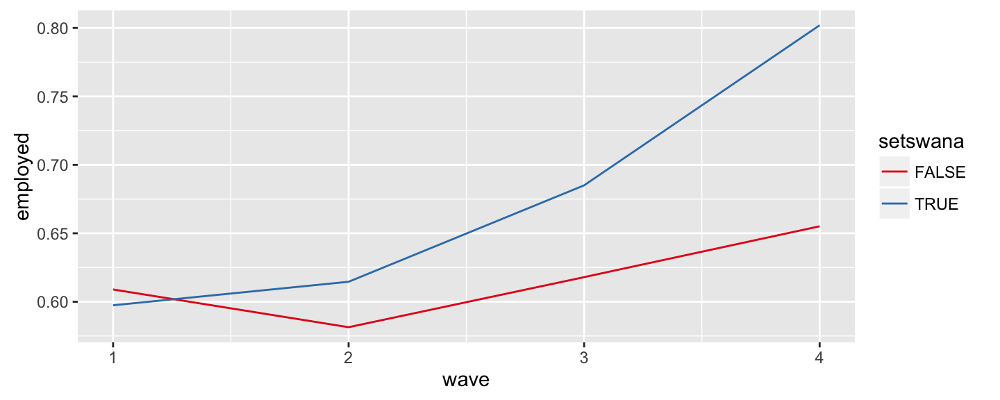

# Making the Next Billion Demand Access:<br/> `google.co.za` in Setswana
Bastiaan Quast  
10 November 2016  


## Introduction

* improved reach and affordability
* yet, stagnating growth


```r
ggplot(data=WB2016, aes(x=year, y=adoption, colour=region)) + geom_smooth(se=FALSE)
```

<!-- -->


## Language Disparities


**QUESTION**: lowest bars, chicken vs. egg?


## Cross-Side Network Effects (2SM)





## Stacked 2-Sided Markets



## Research Design

**Identification Strategy**: Setswana introduced on `google.co.za` at end the of 2010

  * Spillover of translation work for `google.co.bw`
  
**Data**: South Africa's National Income Dynamics Survey (2008, 2010, 2011)

  * around 10,000 households; 50,000 adults; 10,000 Setswana speakers
  * cellphones; computers; internet access and expenditure

<!-- -->


## Internet Usage


```r
lm(h_nfnet ~  interface_intro*setswana +
              woman                    +
              hhincome             	   + 
              best_edu)
```

                                      Estimate   Std. Error     t value    Pr(>|t|)
---------------------------------  -----------  -----------  ----------  ----------
(Intercept)                         -0.0053453    0.0012538   -4.263261   0.0000202
interface_introTRUE                 -0.0087442    0.0009761   -8.958623   0.0000000
setswanaTRUE                        -0.0126838    0.0022931   -5.531323   0.0000000
womanTRUE                           -0.0020223    0.0009394   -2.152631   0.0313512
hhincome                             0.0000031    0.0000000   65.212592   0.0000000
best_edu                             0.0008878    0.0000749   11.856907   0.0000000
interface_introTRUE:setswanaTRUE     0.0107539    0.0031159    3.451259   0.0005583

* Covariates: linguistic skills
* Alt. formulation, Interact `interface_intro` with `language`: similar results


## Computer Ownership


```r
lm(a_owncom ~ interface_intro*setswana + 
              woman                    + 
              hhincome             	   + 
              best_edu)
```

                                      Estimate   Std. Error      t value    Pr(>|t|)
---------------------------------  -----------  -----------  -----------  ----------
(Intercept)                         -0.0143584    0.0021360    -6.721999   0.0000000
interface_introTRUE                  0.0070789    0.0016500     4.290279   0.0000179
setswanaTRUE                        -0.0132797    0.0042782    -3.104031   0.0019096
womanTRUE                           -0.0315572    0.0015182   -20.785807   0.0000000
hhincome                             0.0000059    0.0000001    85.869415   0.0000000
best_edu                             0.0045057    0.0001232    36.560469   0.0000000
interface_introTRUE:setswanaTRUE     0.0220040    0.0053089     4.144727   0.0000341


## Usage of Setswana online




* thuso = help (common term on Google Trends)


## Internet Expenditure -> Employment


```r
pids <- adulthh[which(adulthh$wave==3 & adulthh$h_nfnet==TRUE),]$pid
adulthh %>%
  filter(pid %in% pids) %>%
  group_by(setswana, wave) %>%
  summarise(employed = mean(employed, na.rm=TRUE)) %>%
  ggplot(aes(x=wave, y=employed, colour=setswana)) %+%
    geom_line() %+%
    scale_colour_brewer(palette='Set1')
```

<!-- -->


## Computer Ownership -> Employment


```r
pids <- adulthh[which(adulthh$wave==3 & adulthh$a_owncom==TRUE),]$pid
adulthh %>%
  filter(pid %in% pids) %>%
  group_by(setswana, wave) %>%
  summarise(employed = mean(employed, na.rm=TRUE)) %>%
  ggplot(aes(x=wave, y=employed, colour=setswana)) %+%
    geom_line() %+%
    scale_colour_brewer(palette='Set1')
```

<!-- -->


## Closing Remarks

* accessibility improves adoption
* observed long term commitment: computer ownership
* mobile needs directly visible link
* available online: http://qua.st/internet-access
    * data
    * code
    * paper
    * presentation
